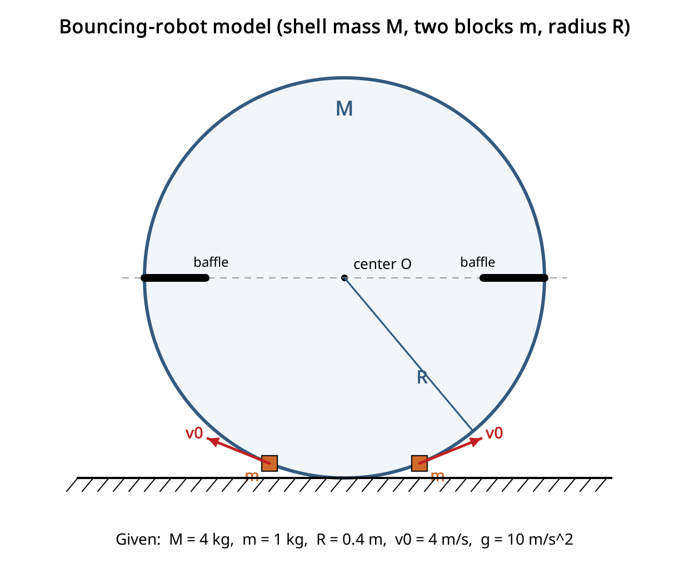
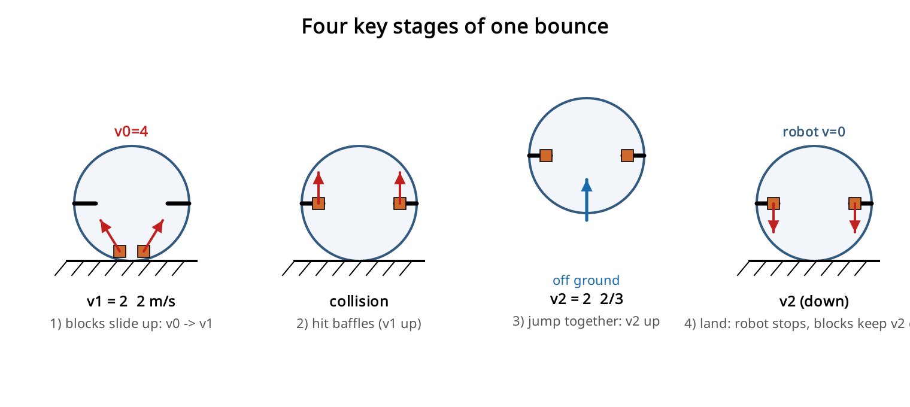
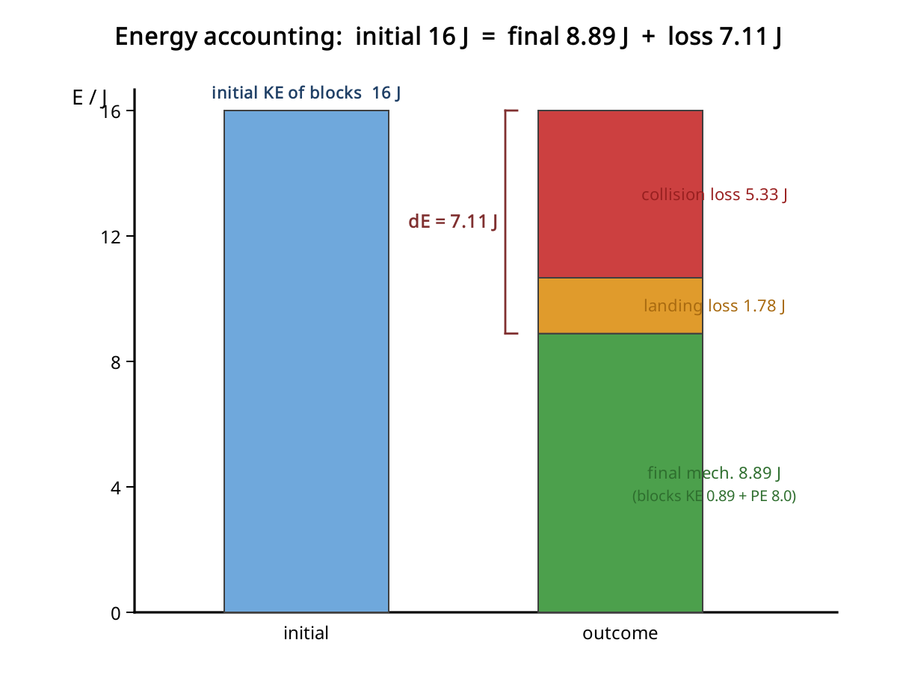
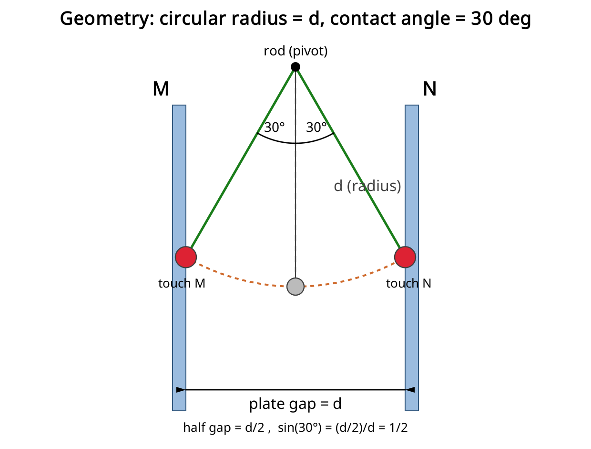
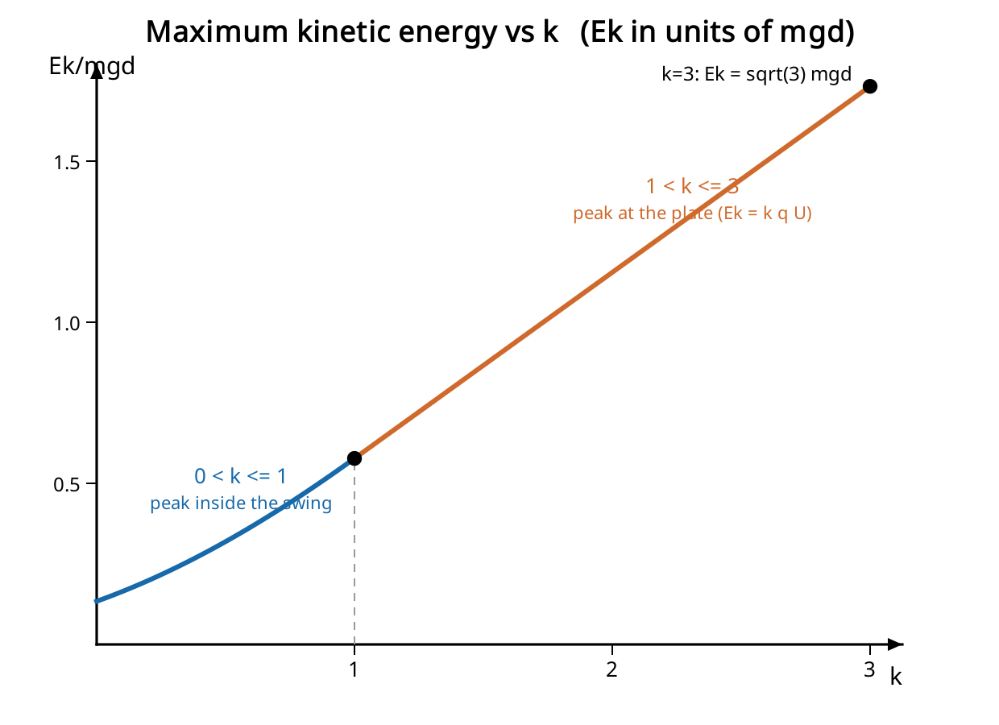

# gaokaophysics

高考物理压轴题详解（持续更新，图文并茂）。

在线页面：
- 首页（压轴题详解）：index.html
- 新增专题：创新物理实验设计 · 高中生动手探究 10 例 —— experiments.html

目录：
- 第 14 题：弹跳机器人模型（动量 + 能量）
- 第 15 题：平行板电容器中的小球往复圆周运动

---

## 专题：创新物理实验设计 · 高中生动手探究 10 例（experiments.html）

面向高中生的创新实验设计方案，把经典竞赛题与教科书场景"实体化"，覆盖力学 / 转动 / 电磁 / 热学 / 光学，并用一条多米诺连锁装置把它们串起来。每个实验都给出：涉及知识、实验原理（纯文本公式）、内嵌 SVG 原理图、材料清单、设备、制作方法与步骤、数据分析、注意事项、难度分析、合理性分析。

10 个实验：
1. 最速降线赛道（力学·变分思想）
2. 动量放大"火箭球"发射器（力学·弹性碰撞）
3. 耦合摆与共振演示墙（力学·受迫振动）
4. 角动量守恒转盘（转动·守恒律）
5. 铜管中"缓降"的磁铁（电磁·楞次定律涡流）
6. 30 秒单极电机（电磁·安培力）
7. 手摇发电机（电磁·法拉第定律）
8. 瓶中云（热学·绝热膨胀）
9. 人造天空与日落（光学·瑞利散射）
10. 跨学科多米诺连锁装置（综合·能量链）

另含"教学组织与评价建议"（难度学科一览表、推进路线、过程性评价量规）。

---

## 第 14 题：弹跳机器人模型（动量 + 能量）

### 题目

如图为一种弹跳机器人模型，机器人内壳可近似为球形，在与球心等高处两侧各有一挡板与内壳相连。初始时有两个可视为质点的小物块在内壳底部，以初速度 v0 沿着内壳向上运动。已知机器人整体质量 M=4kg，两物块质量均为 m=1kg，内壳半径 R=0.4m，物块初速度 v0=4m/s。当物块与挡板相碰后，立即与机器人一起向上运动。当机器人重新落到地面时，机器人的速度立即变为 0，物块速度保持不变并继续向下运动。（取 g=10 m/s^2）求：

1. 机器人起跳时的动能 Ek；
2. 机器人能上升的最大高度 h；
3. 从初始状态到落地后，整个系统损失的机械能 ΔE。

---

### 一、过程分析（理清四个关键阶段）

整个弹跳分四步，速度变化是解题主线：

1. 两物块从壳底沿光滑内壳上滑，到达“与球心等高”的挡板处（上升高度 = R）。此过程机器人被地面支撑、保持静止。
2. 物块在挡板处与机器人发生“完全非弹性碰撞”（碰后一起运动）——这就是起跳瞬间。
3. 整体（M+2m）以共同速度 v2 竖直上抛，达到最大高度 h 后落回。
4. 落地瞬间机器人速度变为 0（损失其动能），物块保持速度继续向下。

关键几何点：物块到达挡板时位于球壳“侧边、与球心等高”处，该处切线方向竖直，所以物块到挡板时速度方向竖直向上，碰撞传递的是竖直方向动量。

---

### 二、第 (1) 问：机器人起跳时的动能 Ek

**第 1 步，物块到挡板的速度 v1（能量守恒，内壳光滑，上升高度 R）：**

    (1/2)*m*v0^2 = (1/2)*m*v1^2 + m*g*R
    v1^2 = v0^2 - 2*g*R = 16 - 2*10*0.4 = 8
    v1 = 2*根号2 ≈ 2.83 m/s（方向竖直向上）

**第 2 步，碰撞起跳（竖直方向动量守恒）。** 两物块（共 2m，速度 v1 向上）与静止的机器人（M）碰后一起运动，共同速度 v2：

    2*m*v1 = (M + 2*m)*v2
    v2 = 2*m*v1 / (M + 2*m) = 2*1*2根号2 / (4 + 2) = 2根号2/3 ≈ 0.94 m/s

**机器人起跳时的动能**（机器人质量 M=4kg，起跳速度 v2）：

    Ek = (1/2)*M*v2^2 = (1/2)*4*(8/9) = 16/9 ≈ 1.8 J

（若把“机器人+两物块”整体动能一起算，则为 (1/2)*(M+2m)*v2^2 = 8/3 ≈ 2.7 J；按题意“机器人”指 M，取 Ek = 16/9 J。）

---

### 三、第 (2) 问：上升的最大高度 h

起跳后整体做竖直上抛，只受重力，做匀减速。最大高度只与起跳速度有关（与质量无关）：

    h = v2^2 / (2*g) = (8/9) / (2*10) = 2/45 ≈ 0.044 m

即约 4.4 cm。

---

### 四、第 (3) 问：从初始到落地，系统损失的机械能 ΔE

机械能损失发生在两处：**挡板碰撞**和**落地**。用“首末能量法”最直接（取物块初始位置为重力势能零点；机器人上抛后又落回原高度，其重力势能净变化为 0）。

**初态机械能**（只有两物块有动能）：

    E_初 = 2*(1/2)*m*v0^2 = 2*0.5*1*16 = 16 J

**末态机械能**（落地后：机器人速度变 0；两物块以 v2 向下、且停在挡板处，比初始高 R）：

    物块动能 = 2*(1/2)*m*v2^2 = v2^2 = 8/9 ≈ 0.89 J
    物块重力势能 = 2*m*g*R = 2*1*10*0.4 = 8 J
    机器人动能 = 0
    E_末 = 8/9 + 8 = 80/9 ≈ 8.89 J

**损失的机械能：**

    ΔE = E_初 - E_末 = 16 - 80/9 = 64/9 ≈ 7.1 J

**交叉验证（分阶段累加损失，结果一致）：**

    碰撞损失 = 碰前动能 - 碰后动能 = v1^2 - (1/2)(M+2m)v2^2 = 8 - 24/9 = 16/3 ≈ 5.33 J
    落地损失 = 机器人损失的动能 = (1/2)*M*v2^2 = 16/9 ≈ 1.78 J
    合计 = 16/3 + 16/9 = 64/9 ≈ 7.1 J  ✓

下图按“初态 16 J = 末态机械能 + 各处损失”给出能量去向：

---

### 五、答案小结

| 小问 | 结果 |
| --- | --- |
| (1) 机器人起跳动能 | Ek = 16/9 J ≈ 1.8 J |
| (2) 最大上升高度 | h = 2/45 m ≈ 0.044 m |
| (3) 系统机械能损失 | ΔE = 64/9 J ≈ 7.1 J |

中间量：v1 = 2根号2 ≈ 2.83 m/s（到挡板）；v2 = 2根号2/3 ≈ 0.94 m/s（起跳/落地速度）。

---

## 第 15 题：平行板电容器中的小球往复圆周运动

### 题目

平行板电容器间距为 d，正中间有一杆与极板平行，杆两端连着两根绝缘绳，绳长与杆长相等，绳子末端吊着一个带电量为 q、质量为 m 的小球。初始时极板电压为 0，小球静止。随后缓慢增大电压，使小球往 N 板偏移，偏移过程中小球始终受力平衡。当极板电压增大至 U 时，小球与 N 板接触，电荷量立即变为 -q，随后保持极板电压 U 不变。在后续运动过程中，只要小球触碰到极板，速度都立即变为 0，且带电量“大小不变、电性相反”，小球将在极板间做往复圆周运动。求：

1. 极板的恒定电压 U；
2. 小球第一次到达 M 极板前瞬间，绳子的拉力大小 T；
3. 若小球每次接触极板后，极板间电压变为原来的 k 倍（k>0），求能让小球继续做圆周运动的 k 值的取值范围，并求在此范围下不同 k 值对应的小球最大动能 Ek。

---

### 一、几何关系（解全题的关键）

小球挂在杆下方、竖直距离为 d，因此它绕杆做半径为 d 的圆周运动。板间距是 d，所以每块极板离中线 d/2。小球碰到极板时水平位移恰好是 d/2，于是

    sin(theta) = (d/2) / d = 1/2  =>  theta = 30 度

也就是说，每次碰板都发生在偏离竖直方向 30 度的位置。

> 说明：杆为悬挂点（圆心），小球在半径为 d 的圆弧上摆动；当水平偏移达到 d/2 时小球碰板，对应摆角 30 度。

---

### 二、第 (1) 问：恒定电压 U

缓慢升压的整个过程中小球始终处于受力平衡（准静态）。当它刚碰到 N 板时绳子与竖直方向成 30 度，受力只有重力 mg（向下）和水平电场力 F = qU/d：

    水平方向：T*sin30 = qU/d
    竖直方向：T*cos30 = mg

两式相除：

    tan30 = (qU/d) / (mg)
    qU/d = mg*tan30 = mg/根号3

解得：

    U = mgd / (根号3 * q) = 根号3 * mgd / (3q)

---

### 三、第 (2) 问：小球第一次到达 M 前瞬间的绳张力 T

碰 N 后电荷变为 -q，电场力大小 F0 = qU/d = mg/根号3，方向由 N 指向 M。小球从 N（30 度）静止出发摆到 M（另一侧 30 度）。

**能量分析**：N 与 M 等高，重力做功为零；电场力在整个水平跨度 d 上做正功：

    W = F0 * d = qU = mgd/根号3

所以到 M 时动能：

    (1/2)*m*v^2 = mgd/根号3  =>  v^2 = 2gd/根号3

**M 点的径向（指向悬挂点）牛顿第二定律**（此处重力与电场力都有指向圆心外侧的分量）：

    T - mg*cos30 - F0*sin30 = m*v^2/d

代入 cos30 = 根号3/2、sin30 = 1/2、F0 = mg/根号3、m*v^2/d = 2mg/根号3：

    T = 2mg/根号3 + 根号3*mg/2 + mg/(2根号3) = 4mg/根号3

解得：

    T = 4*根号3*mg/3  ≈ 2.31 mg

> 注：这是 V 形双绳的合张力（沿等效半径方向的合力）；若问每根绳，则再除以根号3。

---

### 四、第 (3) 问：电压变为 k*U 后的 k 取值范围与最大动能

此时板间电压为 k*U，驱动力 F = k*F0 = k*mg/根号3。

**(a) 绳保持张紧的条件**：张力在出发的极板处（速度为零、最高点）最小，

    T_出发 = (根号3/2)*mg - F/2

要求 T_出发 >= 0：

    F <= 根号3*mg  =>  k*mg/根号3 <= 根号3*mg  =>  k <= 3

**(b) 能否到达对面极板**：对任意 k>0，电场力在整段摆动做净正功 F*d > 0，重力净功为零，所以小球总能到达对面极板（到达时动能 = F*d > 0）。因此唯一限制就是张紧条件。

**结论：取值范围为 0 < k <= 3。**

**最大动能**。把动能写成摆角 theta 的函数（theta 从竖直方向量起，由 +30 度摆到 -30 度）：

    KE(theta) = mgd*(cos theta - cos30) + F*d*(1/2 - sin theta)

它在切向合力为零处取极大，即有效平衡角 alpha 满足 tan(alpha) = F/mg = k/根号3。只有当 alpha <= 30 度（即 k <= 1）时这个极值点才落在摆动范围之内。于是分两种情况：

- 当 0 < k <= 1（峰值出现在还没到极板的摆动途中）：

      Ek = 根号3 * mgd * (2*根号(k^2+3) + k - 3) / 6

- 当 1 < k <= 3（小球撞到极板时仍在加速，峰值就在极板处）：

      Ek = F*d = k*mg*d/根号3 = 根号3 * k * mgd / 3

**边界验证**：
- k = 1 时两式都给出 Ek = mgd/根号3（约 0.577 mgd）；
- k -> 0 时第一式给出 mgd*(1 - cos30) = 0.134 mgd（相当于单摆摆到最低点）；
- k = 3 时第二式给出 Ek = 根号3 * mgd，这是绳即将松弛前所能达到的最大值。

> 曲线先弯曲（0<k<=1）后变直（1<k<=3），在 k = 1 处出现折点，正是上述两段规律。

---

### 五、答案小结

| 小问 | 结果 |
| --- | --- |
| (1) | U = 根号3 * mgd / (3q) |
| (2) | T = 4 * 根号3 * mg / 3 |
| (3) 范围 | 0 < k <= 3 |
| (3) Ek（0<k<=1） | Ek = 根号3 * mgd * (2*根号(k^2+3) + k - 3) / 6 |
| (3) Ek（1<k<=3） | Ek = 根号3 * k * mgd / 3 |
